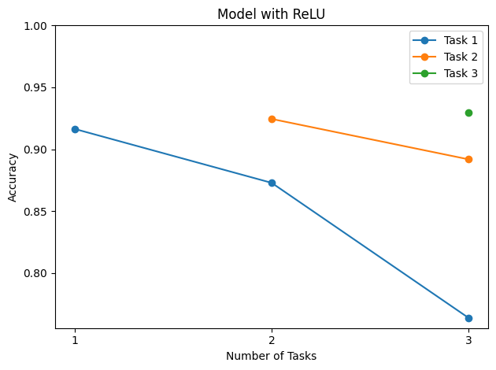
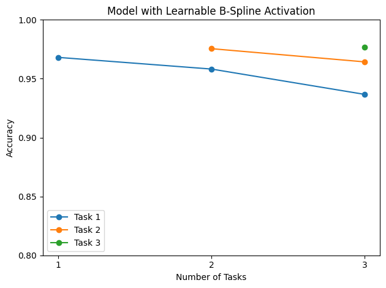
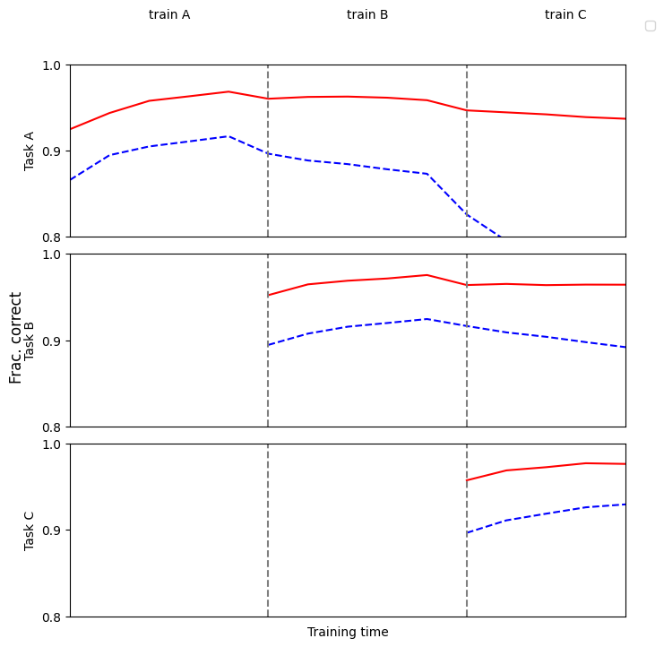
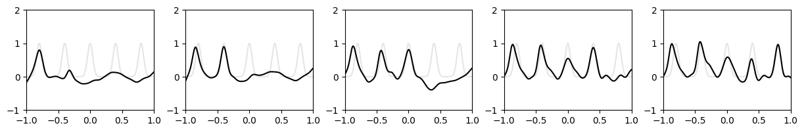
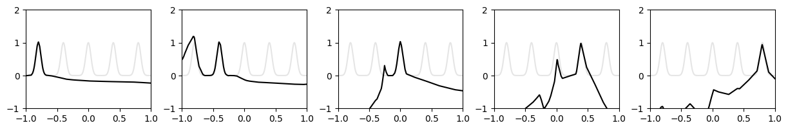

# Learnable B-Spline Activations for Mitigating Catastrophic Forgetting

This repository contains the implementation of my undergraduate thesis:

**Title**:  
**"Using Learnable B-Spline Activation Functions to Address Catastrophic Forgetting in Neural Networks"**  
**Author**: Mahdi Razi Gandomani  
**Supervisors**: Dr. Ali Mohaddeseh Khorasani  
**Institution**: Amirkabir University of Technology (Tehran Polytechnic)  
**Date**: April 2025 (Farvardin 1404)

---

## 📚 Project Overview

**Catastrophic forgetting** remains a major challenge in continual learning systems, where neural networks forget previously learned tasks when adapting to new ones.  
This project proposes a novel **locally learnable activation function** based on **B-spline basis functions** to mitigate forgetting without sacrificing plasticity.

**Key Contributions:**
- Developed a **learnable B-spline activation function** module.
- Integrated B-spline activations into a feedforward neural network architecture.
- Conducted experiments on:
  - **Permuted MNIST continual learning** tasks.
  - **Toy regression tasks** involving **separated Gaussian peaks**.
- Compared models using traditional activations (**ReLU**) versus **learnable B-spline activations**.

---

## 📁 Repository Structure

```bash
.
├── bspline_activation.py      # Learnable B-spline activation module
├── model.py                   # Neural network models with/without learnable activations
├── permuted_mnist.py           # Permuted MNIST dataset creation
├── train_eval_mnist.py         # Training and evaluation on continual MNIST tasks
├── plot_mnist_results.ipynb       # Visualization of forgetting curves (MNIST)
├── toy_regression.ipynb           # Regression task with Gaussian peaks (Toy dataset)
└── README.md                   
```

---

## 🧠 Learnable B-Spline Activation Function

Traditional activation functions (e.g., ReLU, Tanh) are **global** and affect the entire input space. In contrast, B-splines are **locally supported**: a change in one region can leave other regions intact, helping to mitigate forgetting of previously learned tasks.

In this implementation:
- The activation is a **trainable weighted sum of B-spline basis functions**.
- We optimize the **control points** during network training.
- Enables **local adaptation** to new tasks with **minimal interference** to old tasks.
---

## 🔥 Experiments

### 1. Permuted MNIST

- **Task**: Sequential learning of 3 different permutations of MNIST digits.
- **Comparison**:  
  - **Baseline**: MLP with ReLU activations  
  - **Proposed**: MLP with Learnable B-Spline activations
- **Metric**: Classification Accuracy across tasks after each training stage.

**Findings**:
- **Forgetting curves**: Plot the evolution of accuracy after learning each task.
  - The first plot shows how accuracy on previous tasks drops as new tasks are learned.
  - Models with ReLU activations experience steep declines in task accuracy after each new task, a clear sign of catastrophic forgetting.
  - Models with B-Spline activations demonstrate much flatter forgetting curves, indicating stronger retention of previously learned knowledge.




- **Training timeline**: Plot per-task accuracies epoch-by-epoch to observe forgetting behavior.
  - This visualization tracks accuracy on each task throughout all training epochs.
  - It highlights that B-Spline activations enable the network to learn new tasks while maintaining more stable performance on earlier ones, compared to the sharp performance drops observed in ReLU models.
    


- ReLU networks **forget** old tasks significantly after learning new ones.
- B-Spline networks **preserve** higher accuracy on previous tasks.

### 2. Gaussian Peaks Regression (Toy Task)

- **Task**: Sequential modeling of 5 separated Gaussian peaks.
- **Comparison**:
  - **Baseline**: MLP with ReLU activations
  - **Proposed**: MLP with Learnable B-Spline activations
- **Metric**: Regression accuracy on earlier peaks after training new ones.

**Important Note**:  
The toy regression task was adapted and modified from an existing repository:  
👉 [Original Source Repository](https://github.com/KindXiaoming/pykan)

**Findings**:

- **Regression fitting**:
  - These plots show the model’s prediction curves after sequentially learning each Gaussian peak.
  - ReLU networks show strong overfitting to the most recently learned peaks, almost entirely forgetting previously fitted peaks.
  - B-Spline networks retain better fitting of earlier peaks even after multiple new peaks are learned, demonstrating **significantly reduced catastrophic forgetting**.

  
  

  - B-Spline activations allow **localized adaptation**, enabling the model to adjust for new tasks without disrupting earlier learned mappings.
  - ReLU-based models, lacking this local flexibility, experience major interference when new tasks are introduced.

---

## 🛠️ Installation

**Requirements**:
- Python 3.8+
- PyTorch 2.0+
- torchvision
- numpy
- matplotlib

```bash
pip install torch torchvision numpy matplotlib
```

---

## 🚀 Running the Code

For running and visualizing the experiments:
- Simply run `plot_mnist_results.ipynb` for the **Permuted MNIST** forgetting analysis.
- Simply run `toy_regression.ipynb` for the **Gaussian Peaks Regression** fitting experiment.


---


## 📬 Contact

For any questions or suggestions, please reach out to:

- **Email**: [mahdi.razi@aut.ac.ir]

---

## ⭐ Acknowledgments

Special thanks to my supervisors **Dr. Ali Mohaddeseh Khorasani** for their invaluable guidance and support throughout this project.

---
